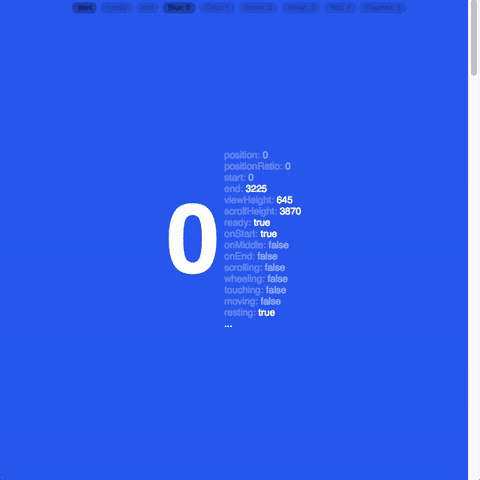
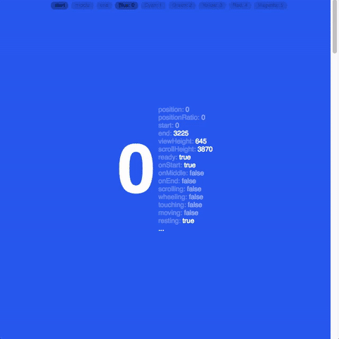
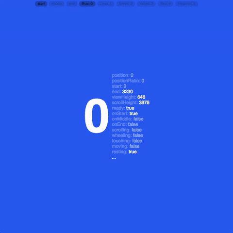

# react-skroll
Uses `react-spring` for butter smooth enhanced scrolling experience

[](https://travis-ci.org/du5rte/react-skroll)
[](https://github.com/du5rte/react-skroll)
[](CONTRIBUTING.md#pull-requests)
[](CONTRIBUTING.md#pull-requests)

## Install
```
npm install react-skroll --save
```

## UMD
```
<script src="https://unpkg.com/react-sprin/web.umd.js"></script>
<script src="https://unpkg.com/react-skroll/dist/react-skroll.js"></script>
```
(Module exposed as `ReactSkroll`)

## Demo
[Codepen Demo](http://codepen.io/du5rte/pen/KrGjEm)

## Usage

### Functional Children Pattern
Most useful for simple scenarios when you only need the `scroll` inside the `Scroller` scope.

```javascript
import { Scroller } from 'react-skroll'

const Demo = () => (
  <Scroller
    scrollRef={ref => this.scroll = ref}
    autoScroll={true}
    autoFrame={true}
  >
    {scroll =>
      <View>
        <Button
          title="1"
          onPress={() => scroll.scrollToNext()}
        />
      </View>
      <View>
        <Button
          title="2"
          onPress={() => scroll.scrollToNext()}
        />
      </View>
    }
  </Scroller>
)
```

### Callback Pattern
Most useful for when you only need to read the `scroll` information

```javascript
import { Scroller, scrollInitalState } from 'react-skroll'

class Demo extends Component {
  constructor() {
    super()

    this.state = {
      // recommend to use for first render
      scroll: scrollInitalState
    }
  }

  render() {
    return (
      <View>
        <Text>{this.State.scroll.position}</Text>

        <Scroller
          onScrollChange={scroll => this.setState({ scroll })}
        >
          <View>
            ...
          </View>
          <View>
            ...
          </View>
        </Scroller>
      </View>
    )
  }
}
```

### Reference Pattern
Most useful for when you need `scroll` outside the `Scroller` scope, for example in a navigation bar.

```javascript
import { Scroller } from 'react-skroll'

class Demo extends Component {
  constructor() {
    super()

    this.scroll = null
  }

  render() {
    return (
      <View>
        <Button
          title="Go to bottom"
          onPress={() => this.scroll.scrollToBottom()}
        />

        <Scroller
          scrollRef={ref => this.scroll = ref}
        >
          <View>
            ...
          </View>
          <View>
            ...
          </View>
        </Scroller>

        <Button
          title="Return to top"
          onPress={() => this.scroll.scrollToTop()}
        />
      </View>
    )
  }
}
```

## Props

### default
Default scrolling with scrollTo and scroll stats features




### autoFrame
Default scrolling with scrolling reframe the view to the current item



### autoScroll
Prevents default scrolling and automatically scroll to next item



### this.props.scroll

Types:
- position: `number`
- positionRatio: `float`
- start: `number`
- end: `number`
- viewHeight: `number`
- scrollHeight: `number`
- ready: `boolean`
- onStart: `boolean`
- onMiddle: `boolean`
- onEnd: `boolean`
- children: `[childScroll]`,
- scrolling: `boolean`
- wheeling: `boolean`
- touching: `boolean`
- moving: `boolean`
- resting: `boolean`
- scrollTo(`position: number` || `name: string` || `node: DOM Element`)
- scrollToPosition(`position`)
- scrollToByIndex(`number`)
- scrollToTop()
- scrollToBottom()
- scrollToElement()
- scrollToActive()

### this.props.scroll.children
- name: `string`
- position: `number`
- positionRatio: `float`
- positionRatioRemainer: `float`
- start: `number`
- end: `number`
- viewHeight: `number`
- onView: `boolean`
- active: `boolean`
- onFrame: `boolean`


## More on props
Check out source code:
- [Scroller.js](https://github.com/du5rte/react-skroll/blob/master/src/Scroller.js)
- [contextProviderShape.js](https://github.com/du5rte/react-skroll/blob/master/src/contextProviderShape.js)
- [nodeToScrollState.js](https://github.com/du5rte/react-skroll/blob/master/src/nodeToScrollState.js#L18)
- [nodeChildrenToScrollState.js](https://github.com/du5rte/react-skroll/blob/master/src/nodeChildrenToScrollState.js#L37)

## TODO
- [ ] Document
- [ ] Test
